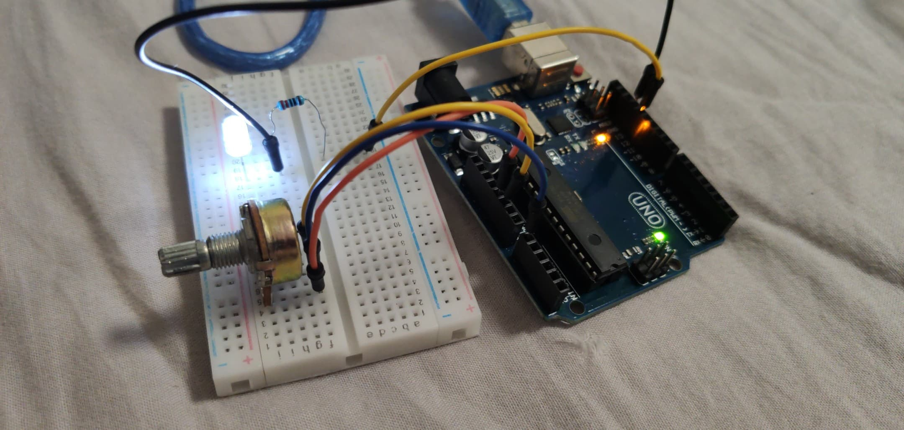
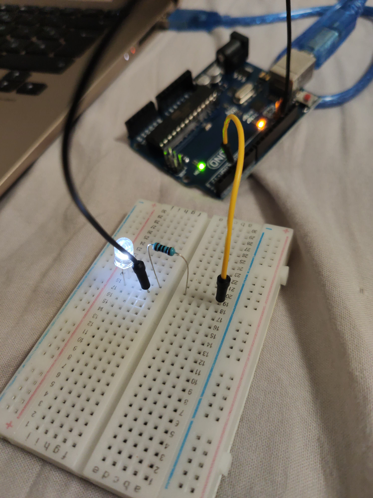

# Exercise 
 
 
1- Control a LED Brightness with a variable resistance.

	- Without a microcontroller
	
	*Before*
	
	
	
	*After*
	
	

	- With a microcontroller
	
	*Before*
	
	
	
	*After*
	
	

2- 4 digit 7Segment Displays  

	- Lesson 15 from the Arduino Starter Kit
	
	

3- Max7219 For LED Matrix

	- From(https://howtomechatronics.com/tutorials/arduino/8x8-led-matrix-max7219-tutorial-scrolling-text-android-control-via-bluetooth/)
	- Display of our team's name in the display
	- Display of an emoji
